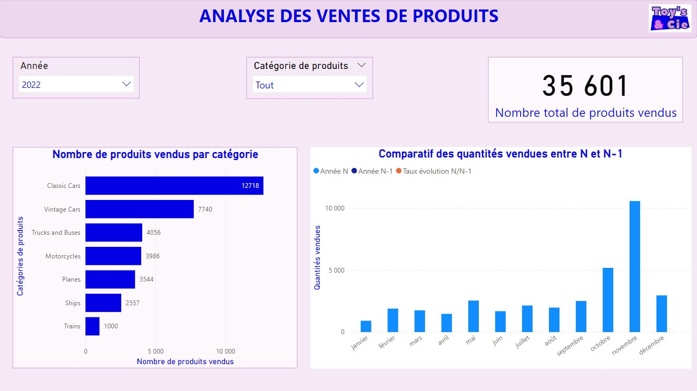
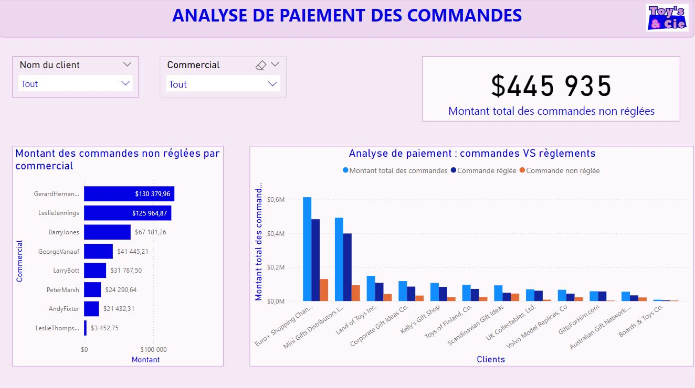
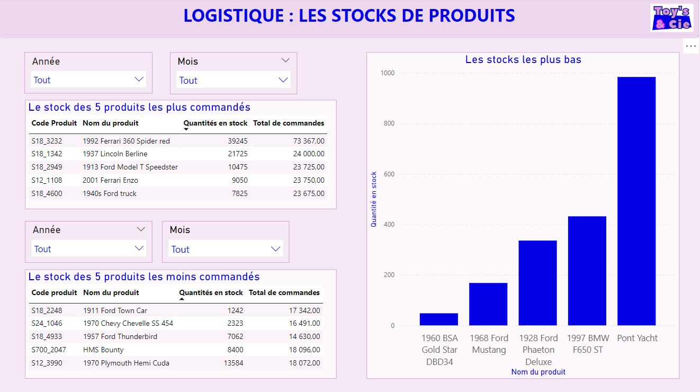
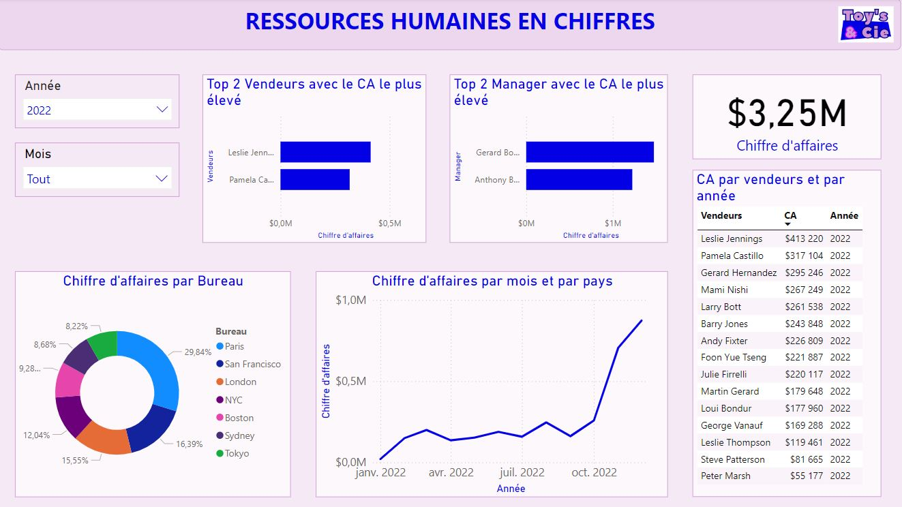
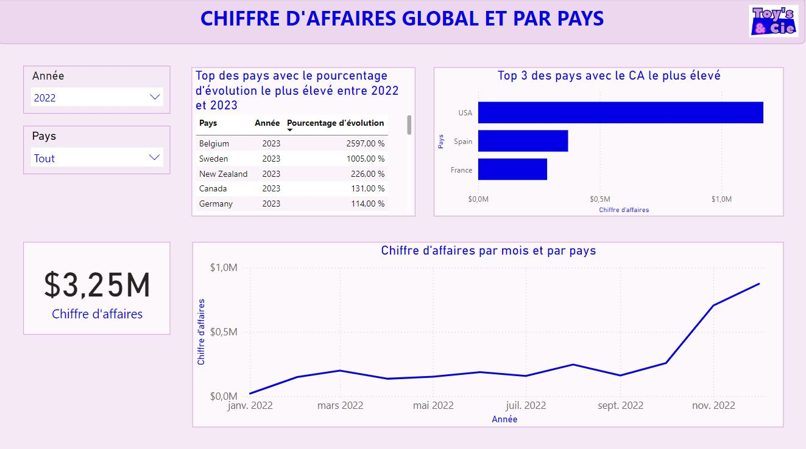

# Projet Toy's and Cie
 

## Table des matières
- [Description](#description)
- [Objectif du projet](#objectif-du-projet)
- [Sources](#sources)
- [Livrables](#livrables)
- [Visualisation](#visualisation)
- [Technologies](#technologies)

## Description

Bienvenue sur le dépôt GitHub de notre projet de groupe réalisé pendant notre formation en Data Analyse avec la Wild code School. Ce projet a été mené par Julien, Marion et moi dans le cadre de notre cursus.
Nous devions déterminer des KPI (Ventes, Finances, logistiques et ressources humaines) afin de réaliser un dashboard pour une société de vente de maquettes et de modèles réduits.

## Objectif du projet:

Vous êtes missionné par une société de vente de maquettes et de modèles réduits. L'entreprise dispose déjà d'une base de données qui répertorie les employés, les produits, les commandes et bien plus encore. Vous êtes invités à parcourir et découvrir cette base de données. Le dirigeant de l'entreprise souhaite disposer d'un tableau de bord qu'il pourra rafraîchir chaque matin pour avoir les dernières informations afin de gérer l'entreprise.

Votre tableau de bord doit s'articuler autour de ces 4 thèmes principaux : ventes, finances, logistique et ressources humaines.
Voici les indicateurs qui devraient être présents dans votre tableau de bord. Des visualisations seraient également appréciées. Et vous êtes invité à pratiquer votre rôle de conseil, par proposer des KPI et des graphiques supplémentaires.
    • Ventes: Le nombre de produits vendus par catégorie et par mois, avec comparaison et taux d'évolution par rapport au même mois de l'année précédente.
    • Finances:
        ◦ Le chiffre d'affaires des commandes des deux derniers mois par pays.
        ◦ Commandes qui n'ont pas encore été payées.
    • Logistique: Le stock des 5 produits les plus commandés.
    • Ressources humaines: Chaque mois, les 2 vendeurs avec le CA le plus élevé.
    
Le projet s'est déroulé en plusieurs étapes :

* Analyse des Données : Explorer les données pour identifier les tendances et les caractéristiques des produits, création d'un dictionnaire des données
* Jointures et Nettoyage : Effectuer des jointures entre les datasets, nettoyer les données et rechercher des corrélations.
* Système de Recommandation : Utiliser des algorithmes de machine learning pour recommander des films en fonction de ceux appréciés par le spectateur.
* Affichage et Interface : Afficher les recommandations et les KPI sur une interface utilisateur, ainsi que des images de films récupérées depuis une base complémentaire de TMDB.

## Sources
Serveur cloud
Vous pouvez vous connecter au serveur MariaDB (un fork de MySQL) de l'entreprise.
Hostname : 51.178.25.157
Port : 23456
Username : toyscie
Password : WILD4Rdata!
    
## Livrables

* Nettoyage, exploration, visualisation des données : Dictionnaire: [fichier Raw](Dictionnaire - Projet 1.docx](https://github.com/victoria-1989/Projet1_wild_code_school/blob/main/Dictionnaire%20-%20Projet%201.docx).
Nettoyage: [jupyter_notebook](https://github.com/victoria-1989/Projet1_wild_code_school/blob/main/Projet_1.ipynb)
* Support de présentation en pdf: [slide_presentation](https://github.com/victoria-1989/Projet1_wild_code_school/blob/main/Projet_Toys__Cie.pdf)
* Visualisation : ouvrez à partir de l'url suivante : [page_powerBI](https://github.com/victoria-1989/Projet1_wild_code_school/blob/main/Projet_SQL_Toys__Cie1.pbix)

## Visualisation

Voici quelques visualisations de données du projet **ToysandCie** :

|  |  |
|---------------------------------------------------------|-------------------------------------------|
| **Analyse des Ventes**                                  | **Commandes**                             |

|              |  |
|---------------------------------------------------------|----------------------------------------------|
| **Logistique**                                          | **Ressources Humaines**                     |

|  |                                              |
|---------------------------------------------------------|----------------------------------------------|
| **Chiffre d'Affaire**                                   |                                              |
## Technologies
| MYSQL | Trello | VS code |
|Power BI|
